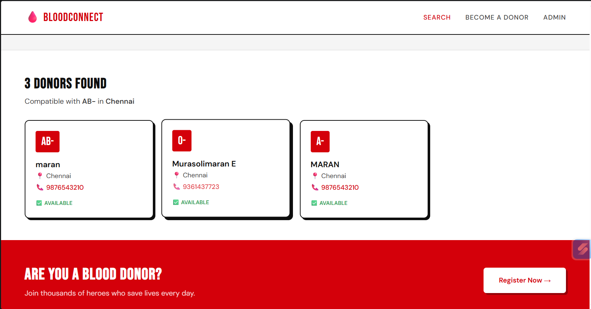
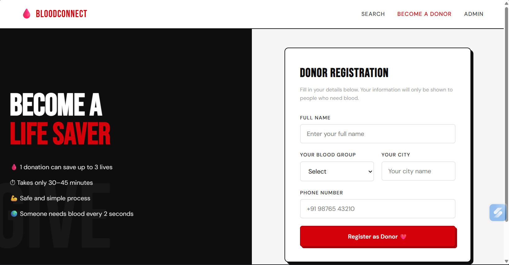
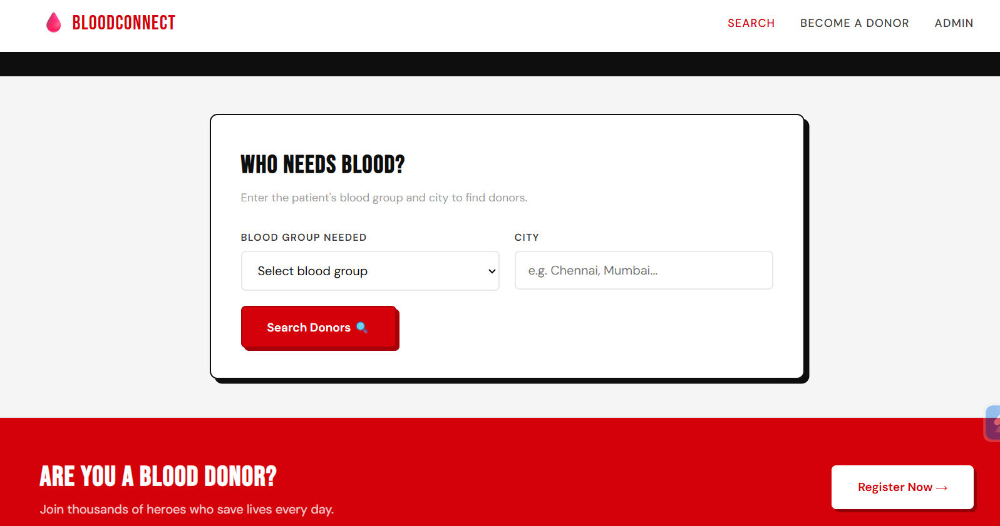
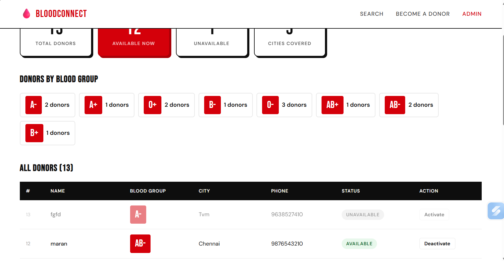
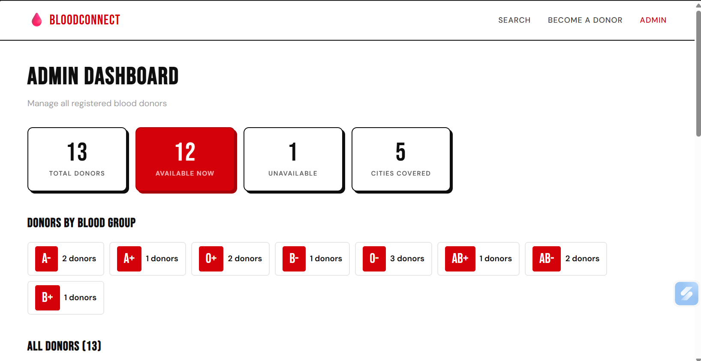

# 🩸 BloodConnect — Blood Donor Finder

> A modern Blood Donor Management System built using **Python, Flask, and MySQL** to help connect blood donors with recipients through a fast, simple, and responsive web application.

---

## 🌐 Live Demo

🔗 **Website**

https://your-live-demo-link.vercel.app/

---

## 📂 GitHub Repository

🔗 **Repository**

https://github.com/murasolimaran-ai/blood-donor-finder

---

# 📸 Project Preview

### 🏠 Home Page

<p align="center">

</p>

---

### 🩸 Donor Registration

<p align="center">

</p>

---

### 🔍 Blood Search

<p align="center">

</p>

---

### 📊 Admin Dashboard

<p align="center">

</p>

---

<p align="center">

</p>

---


# 📖 Project Overview

BloodConnect is a web-based Blood Donor Management System that enables users to register as blood donors and search for available donors based on blood group and location.

The application is designed with a clean and responsive interface using Flask's MVC architecture to separate the presentation layer, business logic, and database operations.

---

# ✨ Features

- 🩸 Blood Donor Registration
- 🔍 Search Donors by Blood Group
- 📍 Search Donors by City
- 📋 View All Registered Donors
- 📊 Admin Dashboard
- 📱 Responsive User Interface
- ⚡ Fast Search Results
- 🗄️ MySQL Database Integration
- 🧩 MVC Architecture
- 💻 Simple & Clean UI

---

# 🛠 Tech Stack

## Frontend

- HTML5
- CSS3
- JavaScript

## Backend

- Python
- Flask

## Database

- MySQL

## Tools

- VS Code
- Git
- GitHub

---

# 📁 Project Structure

```text
blood_donor_finder/
│
├── app.py
├── model.py
├── requirements.txt
├── README.md
│
├── templates/
│   ├── index.html
│   ├── register.html
│   └── admin.html
│
└── static/
    ├── css/
    │   └── style.css
    │
    └── js/
        └── ui.js
```

---

# 🏗 Application Architecture

```text
User

   │

   ▼

Flask Routes (app.py)

   │

   ▼

Database Layer (model.py)

   │

   ▼

MySQL Database

   │

   ▼

HTML Templates

   │

   ▼

Browser Response
```

---

# 🔄 Project Workflow

```text
User visits website

        │

        ▼

app.py receives the request

        │

        ▼

Calls model.py

        │

        ▼

model.py executes SQL query

        │

        ▼

MySQL Database

        │

        ▼

Returns data

        │

        ▼

Flask renders HTML

        │

        ▼

User sees the response
```

---

# 📄 File Description

## app.py

- Main application file
- Handles Flask routes
- Receives user requests
- Calls database functions
- Returns HTML pages

---

## model.py

- Connects to MySQL
- Creates database tables
- Stores donor information
- Searches donor records
- Retrieves statistics
- Handles SQL queries

---

## templates/

Contains all HTML pages.

- Home Page
- Registration Page
- Admin Dashboard

---

## static/

Contains frontend resources.

- CSS Styles
- JavaScript
- UI Components

---

# ⚙️ Installation

## Clone Repository

```bash
git clone https://github.com/murasolimaran-ai/blood-donor-finder.git
```

---

## Navigate

```bash
cd blood-donor-finder
```

---

## Install Dependencies

```bash
pip install -r requirements.txt
```

---

## Configure Database

Open **model.py**

Update your MySQL password.

```python
DB_PASSWORD = ""
```

---

## Run Application

```bash
python app.py
```

---

## Open Browser

```text
http://localhost:5000
```

---

# 🗄 Database Schema

```sql
CREATE TABLE donors (

id INT AUTO_INCREMENT PRIMARY KEY,

name VARCHAR(100),

blood_group VARCHAR(5),

city VARCHAR(100),

phone VARCHAR(20),

available INT DEFAULT 1,

joined_on DATETIME DEFAULT NOW()

);
```

---

# 🩸 Blood Group Compatibility

| Patient Blood Group | Compatible Donors |
|----------------------|-------------------|
| A+ | A+, A-, O+, O- |
| A- | A-, O- |
| B+ | B+, B-, O+, O- |
| B- | B-, O- |
| AB+ | All Blood Groups |
| AB- | A-, B-, AB-, O- |
| O+ | O+, O- |
| O- | O- |

---

# 🐞 Bug Fix

### Problem

Blood groups entered in lowercase (example: **o+**) could not be found during search.

### Solution

```python
blood_group.upper()

city.lower()
```

The application standardizes blood groups and city names before storing them in the database, ensuring consistent and accurate search results.

---

# 🎓 Learning Outcomes

- Flask Web Development
- MVC Architecture
- CRUD Operations
- MySQL Database Integration
- SQL Queries
- HTML Templates with Jinja2
- Form Handling
- Responsive Web Design
- Python Backend Development

---

# 📈 Future Enhancements

- User Authentication
- Role-Based Login
- Email Notifications
- SMS Alerts
- Google Maps Integration
- Hospital Management Module
- Blood Request System
- AI-Based Donor Recommendation
- Cloud Deployment

---

# 👨‍💻 Developed By

**Murasolimaran E**

AI Engineer • Full-Stack Developer

---

# 🌐 Connect With Me

💼 **LinkedIn**

https://linkedin.com/in/murasoli-maran

🌍 **Portfolio**

https://maran-portfolio-pi.vercel.app/

🐙 **GitHub**

https://github.com/murasolimaran-ai

📧 **Email**

murasoli2846@gmail.com

---

# 📄 License

This project is licensed under the **MIT License**.

---

# ⭐ Support

If you found this project useful, please consider giving it a ⭐ on GitHub.

---

<p align="center">

Made with ❤️ by <b>Murasolimaran E</b>

</p>

